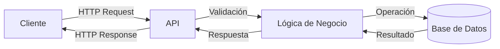

# API REST con Go

API REST moderna y profesional construida con Go, siguiendo principios de arquitectura hexagonal y mejores prácticas de desarrollo.

## Características Principales

- Operaciones CRUD completas para gestión de items
- Base de datos PostgreSQL
- Arquitectura hexagonal para mejor mantenibilidad
- Sistema de logs y monitoreo
- Control de errores robusto
- Límites de tasa de peticiones
- Verificación de estado del sistema
- Configuración flexible por ambiente
- Cierre controlado del servidor

## Flujo de la Aplicación



## Requisitos Previos

- Go 1.21 o superior
- PostgreSQL

## Configuración

1. Crea un archivo `.env` en el directorio raíz con las siguientes variables:

```env
# Aplicación
APP_NAME=api-rest-with-go
APP_VERSION=2.0.0
APP_ENV=development

# Base de Datos
DB_HOST=localhost
DB_PORT=5432
DB_USER=postgres
DB_PASSWORD=tu_contraseña
DB_NAME=api_rest_go
DB_SSLMODE=disable

# Servidor
SERVER_PORT=8080
SERVER_READ_TIMEOUT=10
SERVER_WRITE_TIMEOUT=10
SERVER_IDLE_TIMEOUT=60
```

## Instalación

1. Clona el repositorio
2. Instala las dependencias:
   ```bash
   go mod download
   ```
3. Ejecuta la aplicación:
   ```bash
   go run cmd/api/main.go
   ```

## Endpoints de la API

### Verificación de Estado
- GET `/health` - Verifica el estado de la aplicación
- GET `/ping` - Endpoint simple de verificación

### Gestión de Items
- POST `/api/v2/items` - Crear un nuevo item
- GET `/api/v2/items` - Obtener todos los items
- GET `/api/v2/items/:id` - Obtener un item por ID
- PUT `/api/v2/items/:id` - Actualizar un item
- DELETE `/api/v2/items/:id` - Eliminar un item

## Estructura del Proyecto

```
.
├── cmd/                  # Punto de entrada de la aplicación
├── internal/            # Código interno de la aplicación
│   ├── config/         # Configuración
│   ├── core/           # Núcleo de la aplicación
│   └── infrastructure/ # Implementaciones técnicas
└── .env                # Variables de entorno
```

## Manejo de Errores

La API implementa un sistema robusto de manejo de errores que proporciona mensajes claros y útiles:

- Errores de validación
- Errores de base de datos
- Errores de servidor
- Conflictos de recursos

## Seguridad

- Implementación de rate limiting
- Timeouts configurables
- Validación de entrada
- Soft delete para preservar datos

## Monitoreo

El endpoint `/health` proporciona información sobre:
- Estado de la base de datos
- Recursos del sistema
- Versión de la aplicación
- Estado general del servicio

## Licencia

Este proyecto está licenciado bajo la Licencia MIT - ver el archivo [LICENSE](LICENSE) para más detalles.

## Documentación Técnica

Para información técnica detallada sobre la implementación, arquitectura y patrones de diseño, consulta la [Documentación Técnica](TECH_DOC.md).
